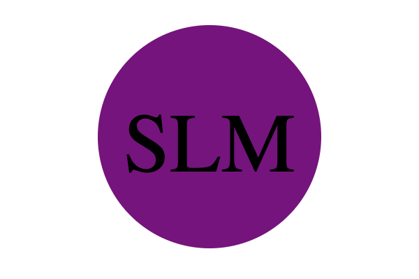

# SVG-Logo-Maker

## Description

- The purpose of this repository is for web developers to generate a simple logo for their projects.

## Usage

- [Click here](*) for a video demo of this application.
- [Click here](https://github.com/hbarry89/SVG-Logo-Maker/blob/main/examples/logo.svg) to see a sample SVG logo.

---------------------------

- You will be presented with a series of questions:

---------------------------

- With a list of the shapes:

---------------------------

- After answering the questions, your answers will be captured AND the output text "Generated logo.svg" is printed in the command line:

---------------------------

- Then an SVG file is created named `logo.svg` in the exmaples folder:

---------------------------

- When you open the `logo.svg` file in a browser, you are shown a 300x200 pixel image that matches the criteria you entered:

---------------------------

## Credit

### Resources :books:
- Bootcamp Materials
- Test files: *shapes.test.js* and *svg.test.js* were provided by TA
- Challenge demonstration by TA in class
- *shapes.test.js* and *shapes.js* file demonstration by instructor in class
- Worked with tutor
- Worked with AskBCS Learning Assistant
- [SVG Explained in 100 Seconds](https://www.youtube.com/watch?v=emFMHH2Bfvo)

### Assets :sparkles:
- [Inquirer Package](https://www.npmjs.com/package/inquirer/v/8.2.4) for collecting input from the user.
- [Jest Package](https://www.npmjs.com/package/jest) for running the unit tests.
- [SVG VS Code extension](https://marketplace.visualstudio.com/items?itemName=jock.svg)

### Applications Used :gear:
- VS Code
- Screencastify

Thank you for visiting! :ribbon:
